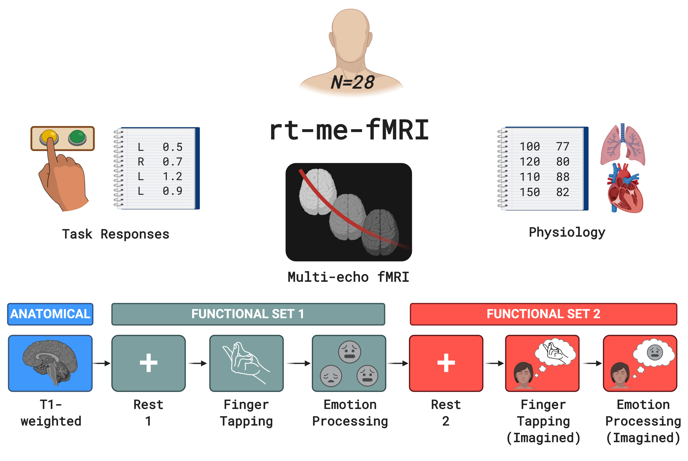

# rt-me-fMRI

 

 
 
[-red.svg)](https://github.com/jsheunis/rt-me-fMRI/blob/master/rt-me-fmri_reproduce_dataFigures.ipynb) 
[-orange.svg)](https://github.com/jsheunis/rt-me-fMRI/blob/master/rt-me-fmri_reproduce_methodsFigures.ipynb) 
[-blueviolet.svg)](https://github.com/jsheunis/rt-me-fMRI/blob/master/rt-me-fmri_reproduce_resultsSummaries.ipynb) 

## Overview
This repository contains descriptions, code and data related to the real-time multi-echo functional magnetic resonance imaging (rt-me-fMRI) project conducted at the [Electrical Engineering department](https://www.tue.nl/en/research/research-groups/signal-processing-systems/) of the Eindhoven University of Technology. Project outputs include: 

1. A dataset and related publication:

    [**rt-me-fMRI: A task and resting state dataset for real-time, multi-echo fMRI methods development and validation**](https://doi.org/10.1101/2020.12.07.414490)

2. A methods publication:

    [**Evaluating multi-echo fMRI combination and <i>T2\*</i>-mapping for offline and real-time BOLD sensitivity**]()

Below we provide more information and instructions regarding:
- The dataset summary
- How to download the data
- How to explore the data
- How to reproduce results and figures from the publications
- Relevant software tools
- How to cite this work
- How to contribute

## Data summary

The `rt-me-fMRI` dataset is a multi-echo fMRI dataset (N=28 healthy participants) with four task-based and two resting state runs that were collected, curated and made available to the research community. Its main purpose is to advance the development of methods for real-time multi-echo functional magnetic resonance imaging analysis with applications in real-time quality control, adaptive paradigms, and neurofeedback, although the variety of experimental task paradigms supports a multitude of use cases. Tasks include finger tapping, emotional face and shape matching, imagined finger tapping and imagined emotion processing. This figure summarises the collected data:

The full data description is available as a [data article](https://doi.org/10.1101/2020.12.07.414490) (currently a preprint on BioRxiv).

Several depictions of the data tree can be viewed [here]()

## Downloading the data

The `rt-me-fMRI` dataset is available for reuse for the purpose of scientific research or education in the field of functional magnetic resonance imaging. If you wish to use the data, you have to agree to the terms of a [Data Use Agreement](https://github.com/jsheunis/rt-me-fMRI/blob/master/DUA.md) when downloading the data.

The dataset itself can be downloaded from DataverseNL [via this link](https://doi.org/10.34894/R1TNL8).

The dataset was collected, processed and shared in accordance with the European Union's General Data Protection Regulation (GDPR) as approved by Data Protection Officers at the research institution. These specific conditions aim for personal data privacy to be prioritised while adhering to FAIR data standards ("findable, accessible, interoperable, reusable"). Procedures included de-identifying brain images (e.g. removing personally identifiable information from image filenames and metadata and removing facial features from T1-weighted images), converting the data to BIDS format, employing a Data Use Agreement, and keeping participants fully informed about each of these steps and the associated risks and benefits.

Much of the work that went into this administrative process has been documented as part of the output of the [Open Brain Consent](https://open-brain-consent.readthedocs.io/en/stable/gdpr/index.html) Working Group, accessible [here](10.31234/osf.io/f6mnp).

## Exploring the data

To explore the dataset's derivative measures interactively, visit [this web application](https://rt-me-fmri.herokuapp.com). It was built with Python using the [Plotly Dash framework](https://plotly.com/dash/). The open source code base is available at [this repository](https://github.com/jsheunis/rt-me-fmri-dash).

## Reproducibility: data preparation

The data preparation process is [documented here](https://github.com/jsheunis/rt-me-fMRI/tree/master/data_setup). This includes code to convert neuroimaging, physiological and other data to BIDS format.

## Reproducibility: results

After preprocessing and quality checking of the data (see a full description in the data article) the data were processed and analysed as described in the methods article. Because of data storage limitations, these derivative data are not shared together with the `rt-me-fMRI` dataset. However, code and instructions are provided to allow these derivative data to be reproduced. Additionally, code and instructions are provided to subsequently generate the summary data from which the results of the methods paper as well as the data underlying the Dash application are derived:

- [Code and instructions to generate derivative data](https://github.com/jsheunis/rt-me-fMRI/blob/master/rt-me-fmri_reproduce_derivativeData.ipynb)
- [Code and instcurtions to generate summary data for figures and Dash application](https://github.com/jsheunis/rt-me-fMRI/blob/master/rt-me-fmri_reproduce_resultsSummaries.ipynb)

## Reproducibility: figures

The following notebooks contain code and descriptions that allows figures for the data and methods articles to be reproduced:

- [Data figures](https://github.com/jsheunis/rt-me-fMRI/blob/master/rt-me-fmri_reproduce_dataFigures.ipynb)
- [Methods figures](https://github.com/jsheunis/rt-me-fMRI/blob/master/rt-me-fmri_reproduce_methodsFigures.ipynb)

## Software tools

## Citing this work

Papers, book chapters, books, posters, oral presentations, and all other presentations of results derived from the rt-me-fMRI dataset should acknowledge the origin of the data as follows:

>Data were provided (in part) by the Electrical Engineering Department, Eindhoven University of Technology, The Netherlands and Kempenhaeghe Epilepsy Center, Heeze, The Netherlands

In addition, please use the following citation when referring to the dataset:

>Heunis, S., Breeuwer, M., Caballero-Gaudes, C., Hellrung, L., Huijbers, W., Jansen, J.F.A., Lamerichs, R., Zinger, S., Aldenkamp, A.P., 2020. rt-me-fMRI: A task and resting state dataset for real-time, multi-echo fMRI methods development and validation. bioRxiv 2020.12.07.414490. https://doi.org/10.1101/2020.12.07.414490

And the following citation when referring to the methods article:

>Heunis, S., Breeuwer, M., Caballero-Gaudes, C., Hellrung, L., Huijbers, W., Jansen, J.F.A., Lamerichs, R., Zinger, S., Aldenkamp, A.P., 2020. The effects of multi-echo fMRI combination and rapid T2*-mapping on offline and real-time BOLD sensitivity. bioRxiv [tbd...]

## Contributions / feedback

Feedback and future contributions are very welcome. If you have any comments, questions or suggestions about the dataset or derivative measures, please [create an issue](https://github.com/jsheunis/rt-me-fMRI/issues) in this repository.

